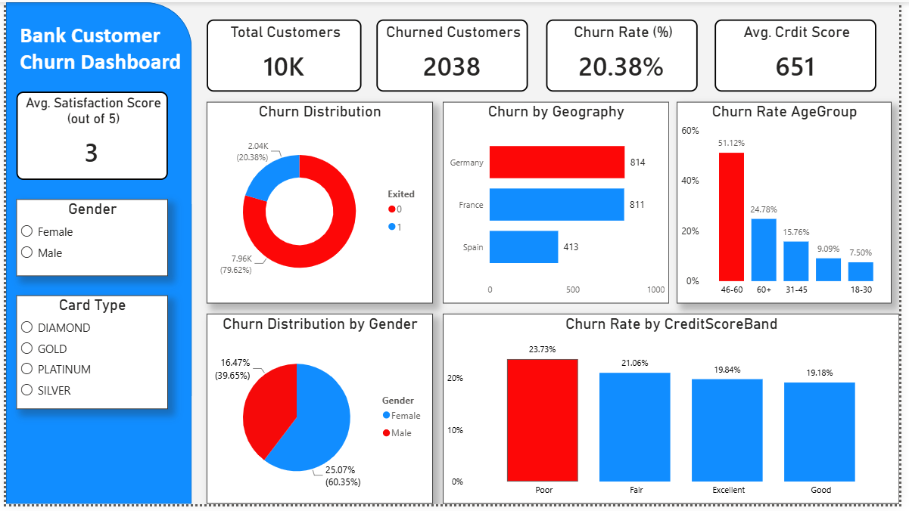
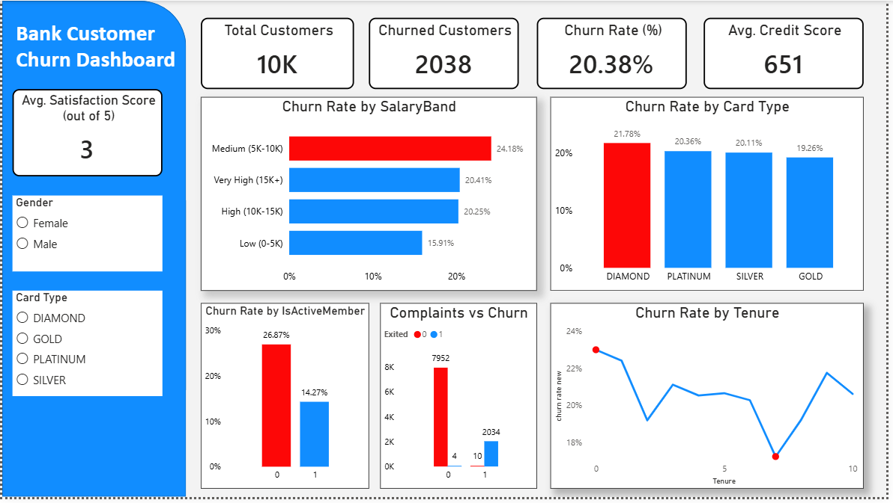
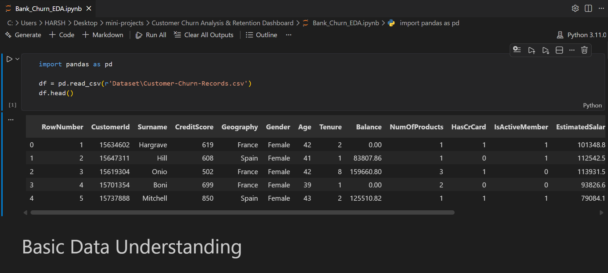
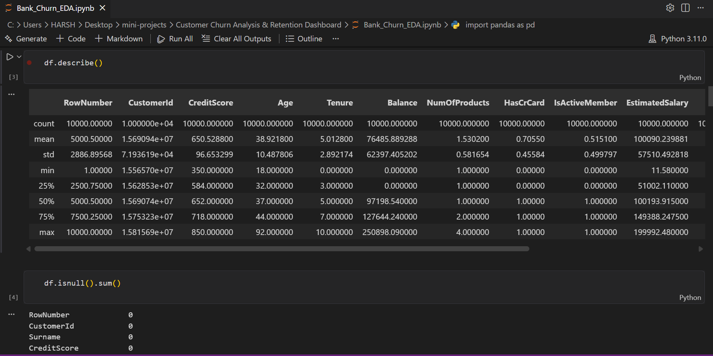
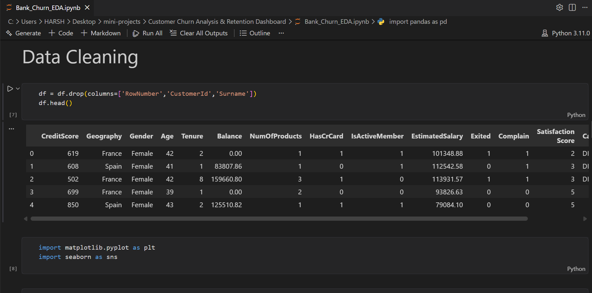
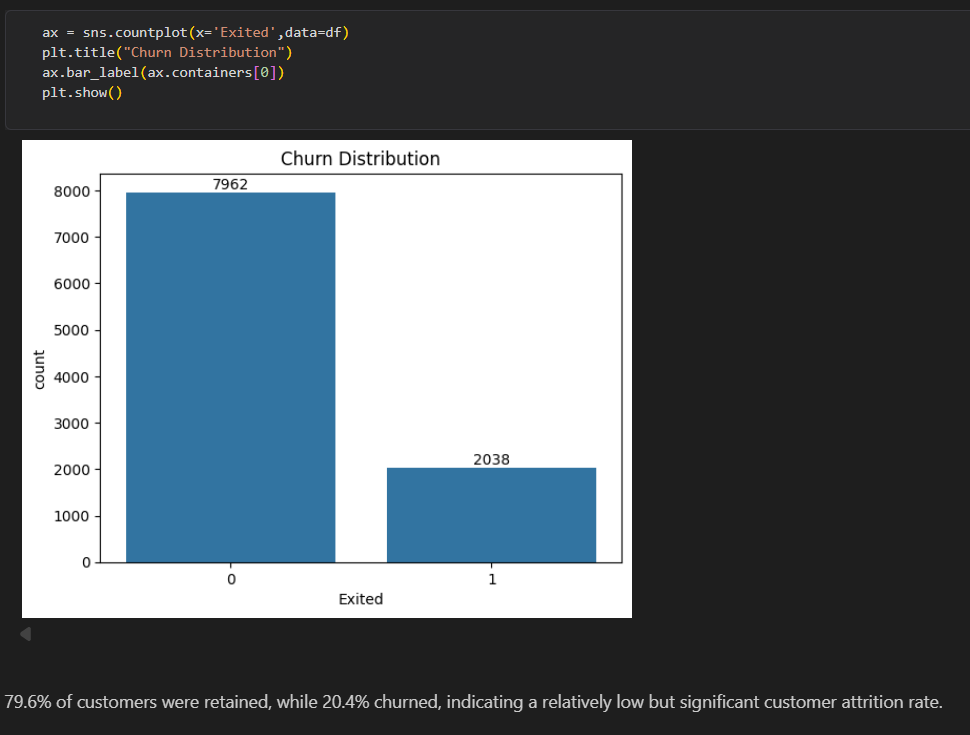
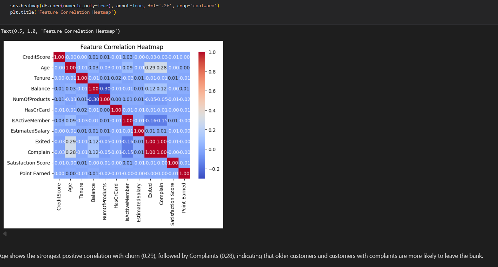

# 🏦 Bank Customer Churn Analysis Dashboard

This project presents an interactive Power BI dashboard developed to analyze customer churn patterns in a banking dataset. The objective is to identify factors contributing to customer attrition and provide actionable insights that can help financial institutions improve customer retention.

The project includes Exploratory Data Analysis (EDA), data cleaning, feature engineering, DAX measures, and interactive Power BI visualizations to uncover trends across customer demographics, activity status, complaints, geography, salary segments, credit scores, and tenure.

---

## 📸 Dashboard Results

### Dashboard - Page 1

### Dashboard - Page 2

---

## 🎯 Business Questions

This dashboard aims to answer the following questions:

- What is the overall customer churn rate?
- Which customer age groups are most likely to churn?
- How does customer activity status affect churn?
- Do customer complaints influence churn behavior?
- Which geographical region has the highest churn?
- Does salary level impact churn probability?
- How does credit score affect customer retention?
- What role does customer tenure play in churn?
- Are certain card types associated with higher churn rates?
- What is the customer distribution across genders?

---

## 🧹 Data Cleaning & Preprocessing

The following preprocessing steps were performed before analysis:

- Removed unnecessary columns:
  - CustomerId
  - Surname
- Checked for missing values and data inconsistencies.
- Created Age Group categories for customer segmentation.
- Created Credit Score Bands for meaningful credit risk analysis.
- Created Salary Bands for income-based churn analysis.
- Generated churn-related measures using DAX.
- Performed exploratory data analysis (EDA) to identify patterns and relationships.

---

### EDA Results

---

## 📈 Dashboard Features

### Page 1

- Total Customers KPI
- Churned Customers KPI
- Overall Churn Rate KPI
- Average Satisfaction Score
- Churn Distribution
- Churn by Geography
- Churn Rate by Age Group
- Customer Distribution by Gender
- Churn Rate by Credit Score Band

### Page 2

- Churn Rate by Salary Band
- Churn Rate by Card Type
- Churn Rate by Active Membership Status
- Complaints vs Churn Analysis
- Churn Rate by Tenure

Interactive Filters:

- Gender
- Card Type

---

## 🔍 Key Insights

### 1️⃣ Age Group is the Strongest Churn Driver

Customers aged **46–60 years** exhibit the highest churn rate at **51.12%**, making them the most vulnerable customer segment.

### 2️⃣ Complaints Significantly Increase Churn Risk

Customers who registered complaints were substantially more likely to leave the bank, highlighting complaint resolution as a critical retention strategy.

### 3️⃣ Inactive Customers Churn More Frequently

Inactive customers show a significantly higher churn rate compared to active customers, indicating that customer engagement plays a major role in retention.

### 4️⃣ Medium Salary Customers Have the Highest Churn Rate

Customers within the **5K–10K salary band** recorded the highest churn rate (**24.18%**) among all salary segments.

### 5️⃣ Geographic Differences Exist

Germany recorded the highest number of churned customers compared to France and Spain, suggesting region-specific customer retention challenges.

---

## 🛠 Tools & Technologies

- Power BI
- DAX
- Python
- Pandas
- NumPy
- Matplotlib
- Seaborn
- Jupyter Notebook

---

## 📂 Dataset

**Source:** Kaggle

🔗 Dataset Link:

https://www.kaggle.com/datasets/radheshyamkollipara/bank-customer-churn

---

## 📈 Project Outcomes

- Analyzed 10,000 customer records.
- Identified high-risk churn segments.
- Built interactive Power BI dashboards for stakeholder reporting.
- Generated actionable retention insights based on customer behavior.
- Improved business understanding through EDA and visualization techniques.

---

## 👨‍💻 Author

### Harsh Katariya

Data Analyst | Machine Learning Enthusiast | Power BI Developer

- Bachelor of Engineering (Information Technology)

---
⭐ If you found this project useful, consider giving it a star.
